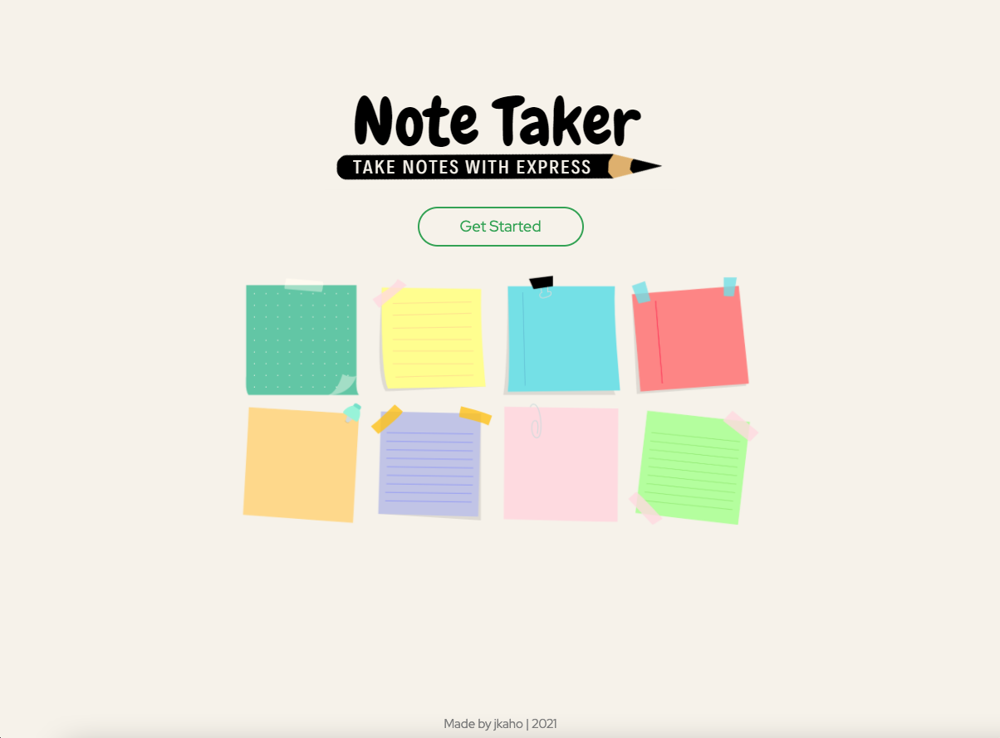
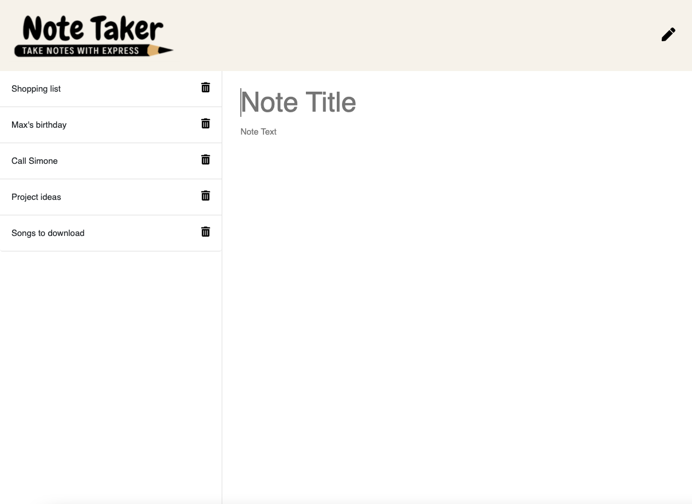

# Note Taker 

## Description 

The aim of this project was to build the back end for the provided front-end code of a simple application used to write and save notes. 
Each note consists of a title and text body, and can be deleted when no longer needed. 

## Technologies Used

- JavaScript
- Node.js
- Express.js 
- npm generate-unique-id package
- npm chalk
- Heroku / Heroku Command Line Interface (CLI)

## Screenshots

### Landing page

### Saved note view

### New note - blank

### New note - with text

## Link

[Link to deployed application](https://jkaho-note-taker.herokuapp.com/)